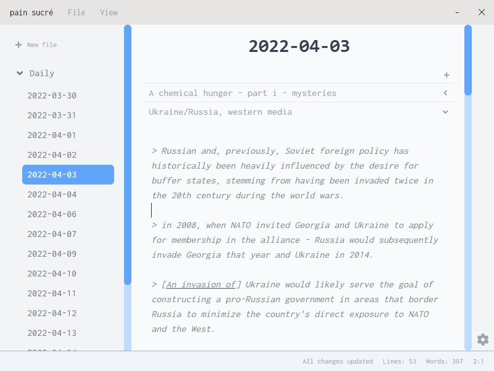

# Scratchpad

A simple, local notes app by [Laura Gao](https://twitter.com/laurgao)

Download [.exe for Windows](./dist/scratchpad%20Setup%200.1.0.exe). Mac/Linux support coming once I figure out how to generate non-Windows installers with electron.

---

### Why did I make Scratchpad?

-   Even with fancy notetaking apps and organized zettelkasten setups, I found myself opening text files to dump my daily scattered thoughts
-   I didn't want to put my fleeting insights (that may or may not be useful in the future) into organized systems but rather have a place that's designed to be messy, an extension of my working memory, and reflective of the messy creative process.
-   ... and I wanted an excuse to learn Electron, to jump out of my bubble of web dev projects with the only stack I know (NextJS/MongoDB).

---

### How does it work?

Scratchpad saves and opens markdown files in a "vault" which is just a folder with all markdown files nested 2 layers of folders underneath.

---

### Why use Scratchpad?

-   No sign-ins
-   No internet needed
-   No privacy concerns
-   No bloated interfaces
-   Just markdown files

---

### Acknowledgements

Other people/projects that inspired or helped me along the way!

-   [Samson Zhang](https://twitter.com/wwsalmon) for encouraging me to work on my projects, being a webdev mentor, and letting me use his project [dotTodo](https://github.com/wwsalmon/dottodo) as an Electron app boiler plate (which itself was built on top of the [vite-reactts-electron-starter](https://github.com/maxstue/vite-reactts-electron-starter)).
-   [Obsidian](https://obsidian.md/) notetaking app for its model of having a vault and markdown files inside

---

### To run

`yarn`, then `yarn dev` to spin up a local app.

`yarn dist` to generate installers.
